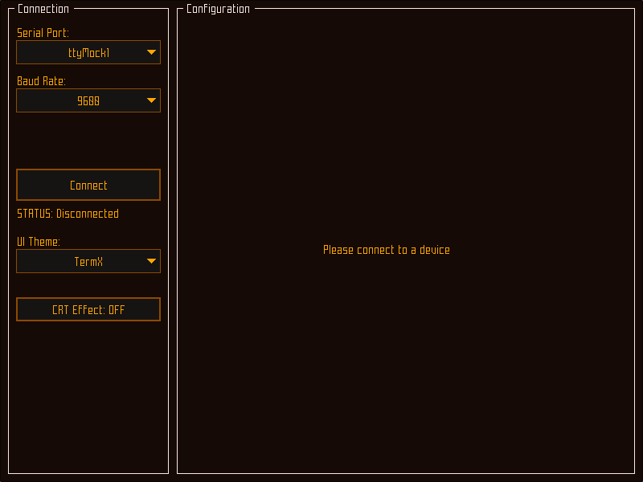
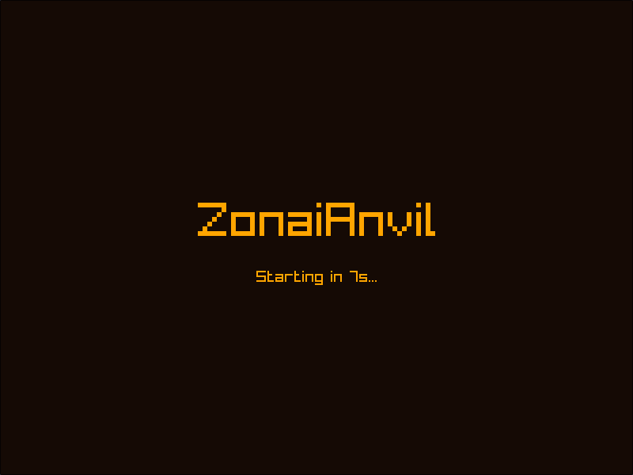

# ZonaiAnvil

ZonaiAnvil is a modern, cross-platform serial communication and device configuration utility built with C++20 and Raylib. It features a retro-inspired terminal interface with customizable themes and a real-time responsive UI.

## Features

- **Responsive Flow Layout**: UI components automatically wrap and adapt to window resizing.
- **Custom Themes**: Includes several built-in themes, including the new **TermX** (Orange Terminal) and a classic Green Terminal.
- **Retro CRT Effect**: Optional shader-based CRT effect with scanlines and shadow mask (lots).
- **Serial Communication**: Support for real serial ports (via Linux serial) and mock ports for simulation.
- **Dynamic Configuration**: Automatically builds the UI based on the device's schema.
- **State Machine Driven**: Robust application logic powered by `boost::sml`.

## Visuals

### Main Interface


### Retro Theme


## Quick Start

### 1. Fetch Dependencies
```bash
./scripts/fetch-requirements.sh
```

### 2. Build the Application
```bash
./scripts/build.sh
```

### 3. Run
```bash
./build/ZonaiAnvil
```

## Documentation

- [System Dependencies](docs/DEPENDENCIES.md)
- [Communication Protocol](docs/PROTOCOL.md)

## Development Tools

- **Formatting**: Use `./scripts/format.sh` to format the codebase using `clang-format`.

## License
MIT
